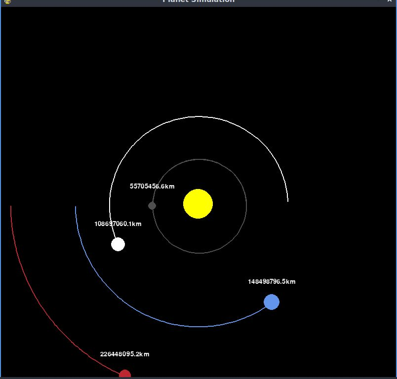

# Planet Simulation solar_system branch

this branch contains the basic version of a planetary simulator, where you can find the sun and the first four planets of the solar system

this is a tutorial taken from the youtube channel tech with tim

