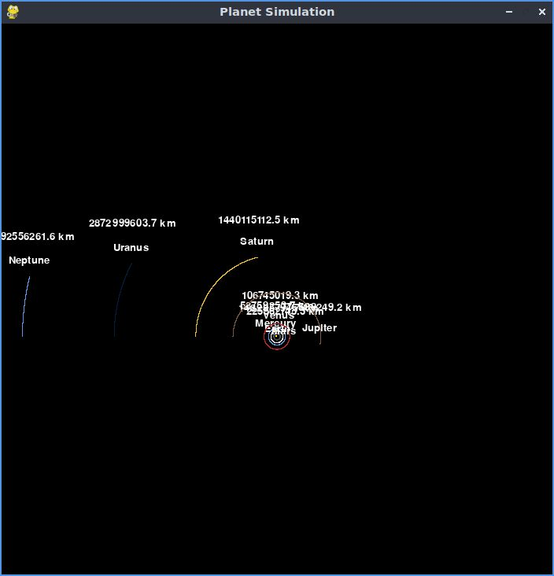

# Solar System Simulation with Pygame



An interactive 2D simulation of our solar system demonstrating orbital mechanics and gravitational interactions.

## Features

- Real-time gravitational calculations using Newtonian physics
- 8 planets with realistic orbital velocities
- Adjustable camera view and zoom controls
- Visual orbital trails
- Planet names and real-time distance-to-Sun display
- Scalable simulation (1 Astronomical Unit = 250 pixels)

## Requirements

- Python 3.6+
- Pygame 2.0+

## Installation

1. Clone repository:
   ```bash
   git clone https://github.com/edimez14/planet_simulation
   ```
2. Install dependencies:
   ```bash
   pip install pygame
   ```

## Usage

Run the simulation:

```bash
python planet_simulation.py
```

### Controls

| Key          | Action          |
| ------------ | --------------- |
| Arrow Keys   | Pan view        |
| + / -        | Zoom in/out     |
| Close Window | Exit simulation |

## Physics Implementation

- **Gravitational Force**: Calculated using Newton's law of universal gravitation:
  ```math
  F = G\frac{m_1m_2}{r^2}
  ```
- **Orbital Motion**: Velocity updated using:
  ```math
  v_{new} = v_{old} + \frac{F}{m} \cdot \Delta t
  ```
- **Time Step**: 1 simulation day per frame (86400 seconds)

## Code Structure

Key components in `planet_simulation.py`:

### `Planet` Class

- **Attributes**:
  - Position (meters)
  - Mass (kg)
  - Velocity (m/s)
  - Orbital trail history
- **Methods**:
  - `attraction()`: Calculate gravitational force
  - `update_position()`: Update velocity and position
  - `draw()`: Render planet and orbital trail

### Simulation Setup

- Initializes planets with:
  - Real-world astronomical distances
  - Actual planetary masses
  - Measured orbital velocities

## Limitations

- Visual scale differs from physical scale for visibility
- Simplified 2D model (no inclinations or 3D effects)
- No collision detection
- Fixed time step implementation
